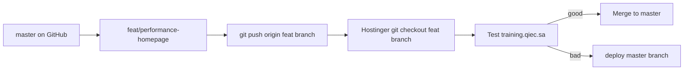

# Deploy a Feature Branch to Hostinger

Use this when testing changes (e.g. performance) **without merging to `master`**.

**Production default stays on `master`** until you merge and deploy normally.

---

## Workflow



### 1. Work on the feature branch (local)

```bash
git checkout feat/performance-homepage
# ... make changes, commit ...
git push -u origin feat/performance-homepage
```

### 2. Build assets (if CSS/JS changed)

```bash
npm run build:landing
git add public/build
git commit -m "build: landing assets"
git push origin feat/performance-homepage
```

### 3. Deploy that branch to Hostinger

**Git Bash:**

```bash
./scripts/deploy-to-hostinger.sh feat/performance-homepage
```

**PowerShell:**

```powershell
.\scripts\deploy-to-hostinger.ps1 -Branch feat/performance-homepage
```

**Manual SSH (same thing):**

```bash
ssh hostinger-qiec "cd domains/training.qiec.sa/public_html && git fetch origin && git checkout feat/performance-homepage && git pull origin feat/performance-homepage && rm -f bootstrap/cache/config.php"
```

Hostinger will now run whatever is on **`feat/performance-homepage`**, not `master`.

### 4. Verify

```bash
npm run health:production
```

Or open https://training.qiec.sa/ and compare speed.

Check which branch is live:

```bash
ssh hostinger-qiec "cd domains/training.qiec.sa/public_html && git branch --show-current && git log -1 --oneline"
```

---

## Roll back to `master` (safe default)

If the feature branch is not good:

```bash
./scripts/deploy-to-hostinger.sh master
```

Or:

```bash
ssh hostinger-qiec "cd domains/training.qiec.sa/public_html && git fetch origin && git checkout master && git pull origin master && rm -f bootstrap/cache/config.php"
```

You can also use the git tag from [PRODUCTION_ROLLBACK.md](PRODUCTION_ROLLBACK.md):

```bash
ssh hostinger-qiec "cd domains/training.qiec.sa/public_html && git fetch origin && git checkout production-stable-2026-06-26"
```

---

## Important notes

| Topic | Detail |
|-------|--------|
| **`.env`** | Not in git — unchanged when switching branches |
| **`public/store`** | Uploaded media stays on server — not affected by branch switch |
| **Cache clear** | Feature deploy script does **not** run `cache:clear` (avoids post-deploy slowdown). Only removes `bootstrap/cache/config.php` if present |
| **ionCube CLI** | `php artisan` over SSH may fail — website still works |
| **Merge when ready** | Merge feat → `master` on GitHub, then `./scripts/deploy-to-hostinger.sh master` |

---

## Current performance branch

| Branch | Purpose |
|--------|---------|
| `feat/performance-homepage` | Homepage query cache + remove unused DB query |

Config: `config/landing_v1.php` → `homepage_cache_minutes` (default `10`, set `0` to disable).

Clear homepage cache after admin adds courses/posts:

```bash
php artisan cache:forget landing_v1.homepage.ar
```

(Use your locale code if not `ar`.)

---

## Related

- [DEPLOYMENT.md](DEPLOYMENT.md) — normal `master` deploy
- [PRODUCTION_ROLLBACK.md](PRODUCTION_ROLLBACK.md) — emergency restore
